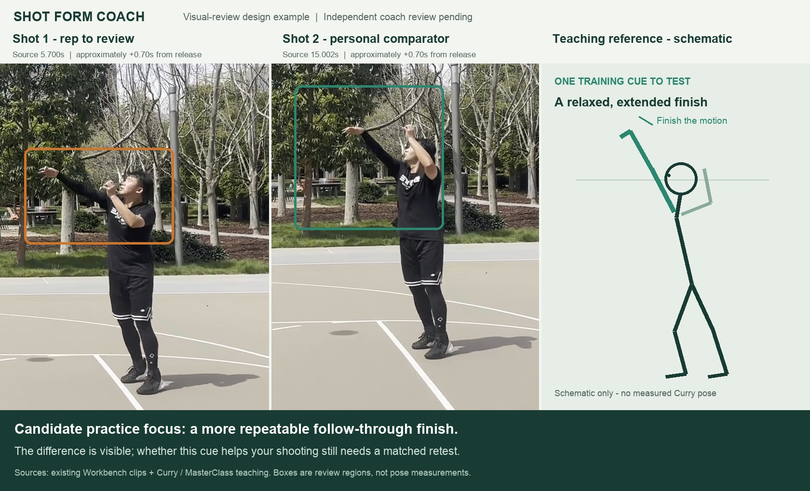

# Shot Form Coach

**Evidence-grounded basketball shooting review, with visual comparisons and actionable practice cues.**

Status: research and design, with a reproducible visual-review example. The automated
pose, measurement, and coaching engine is **not implemented yet**.

This is a separate project from [Video Event Workbench](https://github.com/Michael-Ma/video-event-workbench).
The workbench finds and exports shooting events. Shot Form Coach will import those events,
inspect shooting mechanics, compare matched movement phases, and help a player test one
change at a time.

## The proposed experience

1. Import a shooting session or existing clips, retaining the original video timeline.
2. Check visibility, camera view, shot context, and movement-phase coverage. Automatic phase
   proposals can be corrected with one or two clicks; correction is optional.
3. Review phase-aligned comparisons against a teaching reference or a personal comparator.
4. Receive a small set of findings, each linked to video evidence and a specific practice cue.
5. Record another matched session and check whether the targeted behavior becomes more consistent.

Outputs will include a written review, annotated comparison images, and short comparison
videos. Stephen Curry's published teaching is a source for the initial reference library;
his exact posture is not a universal numerical target for every player or camera view.

## A concrete example from the existing basketball footage

The example below compares the first two saved shooting clips at approximately the same
time after release. Shot 1 lowers its shooting arm earlier in the displayed follow-through
window; Shot 2 provides a personal comparator for that one attribute. The third panel is
an original teaching schematic, **not measured Stephen Curry motion**.



[Watch the comparison video](examples/follow-through-comparison.mp4) ·
[Evidence and interpretation](docs/SAMPLE_REVIEW.zh-CN.md) ·
[Review specification](examples/review-spec.json)

These annotations were created by visual inspection during the design exercise. They are
not automatic pose measurements, coach-validated ground truth, or proof of why a shot missed.
The example demonstrates the output format and an observable difference.

## Design documents

- [Product and system design](docs/DESIGN.zh-CN.md)
- [Curry teaching and technical research](docs/RESEARCH.zh-CN.md)
- [Coaching studies, MediaPipe, and model research](docs/RESEARCH_COACHING_AND_MODELS.zh-CN.md)
- [Model evaluation plan](docs/MODEL_EVALUATION.zh-CN.md)
- [Accepted optional phase-correction decision](docs/ADR-0002-optional-phase-correction.md)
- [Reference motion versus an individual target](docs/ADR-0001-reference-target.md)
- [Initial teaching rules](references/teaching-rules.json)
- [Source catalog](references/sources.json)
- [Example validation](docs/VALIDATION.md)

## Regenerate the example

The original uploads and upstream runtime data are not copied into this repository.
Use your local Video Event Workbench data directory:

```sh
python -m venv .venv
source .venv/bin/activate
pip install -r requirements-render.txt
python scripts/render_example.py \
  --workbench-data /path/to/video-event-workbench/.data \
  --output examples
```

FFmpeg and ffprobe must be on `PATH`. The renderer reads the two clips specified in
`examples/review-spec.json`, preserves their source-time offsets, and produces an annotated
still and a slow-motion comparison. It does not run a model or issue a coaching diagnosis.

The proposed first release targets fixed-camera, unguarded stationary jump shots. Catch-and-shoot,
pull-ups, contested shots, calibrated 3D analysis, and outcome-based improvement claims require
additional reference material and validation.
