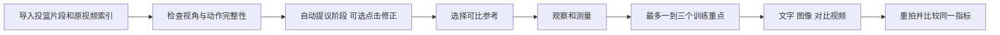
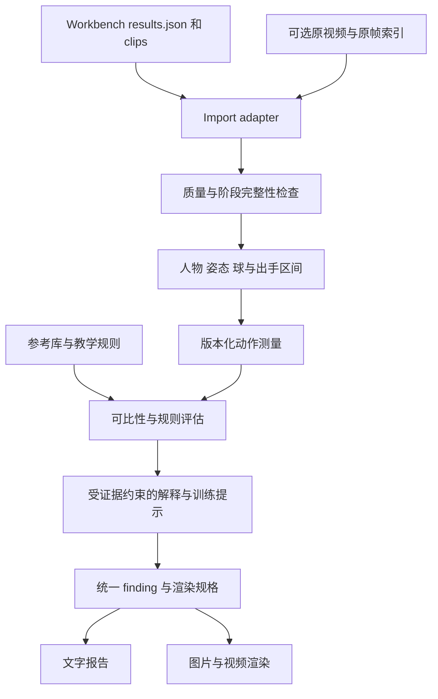

# 投篮动作分析与纠正设计

输入现有工具截取的投篮片段，输出能回到具体帧验证的动作观察、同阶段对比图、短对比视频，以及下一次练习可以执行的一项改动。首批验证素材是现有 6 次投篮；首版聚焦固定机位、无防守的定点跳投。

现有仓库继续负责“找出并截取投篮”。本仓库独立负责“观察动作、比较差异、提出训练假设、检验变化”。当前交付是研究、设计与可重现的图像/视频输出样例，自动分析引擎尚未实现。

## 产品的判断层次

每张问题卡分开呈现四层，避免把可见差异直接写成错误原因：

1. **观察**：视频中发生了什么，例如出手后某一窗口内手臂逐渐降低；附原视频时刻与关键帧。
2. **比较**：与同阶段、相近投篮情境的参考相比有何差异；标明参考类型与可比性。
3. **解释与训练假设**：这个差异可能值得练什么；证据不足时只提出复核问题。
4. **练习与复测**：一个具体提示、一种练法、下一次要测的指标。复测结果可以推翻原建议。

“不像库里”“投失了”“动作幅度较大”都不能单独触发错误判定。图片、视频与文字使用同一个 finding_id 和 evidence_refs，数值来自测量记录，不能由语言模型临时补写。

## 库里参考如何使用

库里的公开教学适合建立最初的动作原则和训练提示，例如从下肢到上肢的协调、适合自己的平衡站姿、出手伸展、近距离 form shooting 和录像复盘。参考分为三种：

| 参考 | 用途 | 约束 |
| --- | --- | --- |
| 库里等球员的教学或经授权示范 | 解释动作原则，做阶段示范 | 记录来源、投篮类型、距离、视角和可用素材范围 |
| 教练确认的情境模板 | 形成可检验的规则或目标区间 | 按投篮情境和视角使用；阈值需要标注数据验证 |
| 用户自己的代表性动作 | 比较同一人的节奏与一致性 | 只证明被选属性的差异；不把一整次动作设为完美标准 |

“理想动作”在界面中应称为“教学参考”或“本次训练目标”。采用阶段锚点对齐，再做平移、尺度和投篮侧归一化。跨视角不能直接把二维骨架像素距离当成动作错误；需要真实三维比较时再引入经过验证的重建/标定流程。

当前没有可直接复用、同机位且逐帧标注的库里运动数据。首批库里资料是公开教学文本、课程预览及官方视频链接。仓库样例用原创教学示意和用户自己的第二球作对照，不冒充库里的实测动作。

## 用户流程

主界面建议三栏：左侧为本次投篮列表及可分析状态；中间为同步播放的本人/参考视频、阶段时间轴和关键帧；右侧为当前 finding 的证据、解释、训练提示和复测按钮。点击文字中的证据应定位到图像和视频中的同一时刻。保留英文与中文界面，模型原始证据按原文保存。

分析前只补充有用的信息：出手侧、投篮类型、是否固定机位，以及可选的距离。系统给出自动建议，用户能更正人物、出手区间和关键点。修改会创建新分析版本并使旧派生报告过期。

2026-10-07 用户确认：第一版默认自动分析，提供一两次点击修正离手区间和关键阶段的可选入口，不要求逐球人工批准。保存模型原提议和用户修正，局部更新相关测量、对比与报告。详见 [ADR 0002](ADR-0002-optional-phase-correction.md)。

## 三种输出

| 输出 | 内容 | 可见证据 |
| --- | --- | --- |
| 文字复盘 | 优先级、观察、参考差异、可能影响、训练提示、复测方式 | 每条都有原视频时刻、来源和支持程度 |
| 对比图片 | 蓄力、举球、离手、随挥等相同阶段并排；必要的区域框、轨迹和目标示意 | 原帧、标注来源、时间范围；示意图明确标为示意 |
| 10–20 秒对比视频 | 一次只讲一个重点；同阶段慢放、关键帧停留、本人和参考并排 | 保留源时间；标明慢放倍率、参考类型、不能判断的部分 |

绿色代表被选择的教学目标或比较样本，橙色代表待检查的本人区域；不能用颜色暗示尚未确认的数值错误。跨视角时优先并排播放和示意，不默认使用重叠骨架。合成的纠正动作只能作为教学示意，不能声称它预测了真实命中结果。

## 技术架构

- **接口层**：FastAPI；直接 MP4 导入和 Workbench JSON adapter。两个仓库通过导出合同连接，不共享数据库，也不把旧截取状态当成教练判断。
- **本地媒体层**：FFmpeg/PyAV，保留实际 PTS、原视频微秒时间、片段时间和输出视频时间的映射。现有 6 FPS 模型输入用于粗定位，动作分析回到原始约 30 FPS 帧。
- **姿态基线**：先验证 MediaPipe Pose Landmarker；困难场景对比 RTMPose/MMPose。保存原始和滤波后的轨迹、可见性及异常标记。姿态置信度不等于测量准确率。
- **球与阶段**：球检测/跟踪和手部位置共同提出离手区间，视觉模型提供粗阶段；允许人工修正。只有身体骨架不足以确认手指离球、辅助手推球或球旋转。
- **测量与规则**：程序计算时序、投影轨迹和一致性；规则按视角/情境启用。VLM 解释已验证事实，提出待复核问题，并从有来源的训练库选提示。
- **报告渲染**：确定性的 SVG/画布/FFmpeg 标注；所有视觉标记由同一份 render_spec 生成。文字中出现的数值必须能解析到 measurement_id。
- **运行记录**：沿用现有项目的 SQLite、任务日志和模型调用费用做法。分析、参考、提示和渲染均版本化，便于复查与重算。

## 首版值得测的内容

| 维度 | 首版指标 | 需要的条件 |
| --- | --- | --- |
| 节奏 | 下沉、起身、举球、离手、落地的顺序和相对时长 | 相应阶段完整可见；以区间表达不确定时刻 |
| 举球路径 | 球、腕相对头肩的位置和投影轨迹 | 球与手连续可见；同视角比较 |
| 出手配合 | 离手相对起跳/起身的时序 | 离手与足部状态均可见；不设统一最佳时间 |
| 随挥 | 离手后的手臂位置变化、结束姿势的持续与重复性 | 足够的后续上下文；出手侧可见 |
| 稳定性 | 同一人的重复动作波动；可见的躯干/足部位移 | 固定机位或可靠的相机运动补偿 |

首版不从当前斜侧面视频给出真实三维关节角、绝对力量、地面反力、精确球速、握球指压、旋转或“改正后命中率”。MediaPipe 的 world coordinates 是模型输出，需要针对本场景验证；它们本身不构成实测三维标定。OpenCap 已有单目 beta 和多机位路径，均应作为后续独立验证选项。

## 核心数据对象

- `ShotAsset`：上游 run/event ID、内容哈希、源帧索引、片段到原视频映射、投篮情境、出手侧。
- `PhaseAnnotation`：蓄力/举球/离手/随挥/落地的区间，创建来源、证据帧和人工复核状态。
- `ReferenceMotion`：教学/比赛/教练模板/个人样本，人物和情境元数据，摄像机信息、阶段锚点、来源及素材使用范围。
- `Measurement`：指标、数值和单位、坐标系、有效条件、缺失原因、证据帧、算法版本；不支持时保留 `null`。
- `Finding`：观察、参考、差异、解释假设、技能属性、训练提示与提示风格、相关示范、证据、复测目标和支持程度。`observed_difference` 与 `coaching_hypothesis` 分开存储。
- `RenderSpec`：使用的 finding/measurement/phase 版本、裁剪、颜色、标签和源时间映射。

源视频缺少后续帧、人物被遮挡、球与手重叠、参考视角不匹配或测量版本过期时，报告应返回具体缺失原因和补拍要求；不能输出一个看似精确的分数。

## 第一轮落地与验收

1. **输出闭环**：从现有 6 球导入，人工辅助确定阶段；交付一项有证据的差异、图片和短视频。当前仓库样例已覆盖这一输出形式。
2. **自动测量基线**：增加姿态/球跟踪、阶段提议和修正界面。先标注 30–50 个来自不同拍摄场次的片段，按场次留出验证，比较自动与复核结果。
3. **教练反馈验证**：小范围复核提示是否合理、是否有误报、用户能否据此完成练习；先开放少数可测量规则。
4. **训练效果闭环**：同一用户在相近距离、机位和练习条件下跨场次复测。动作变化与命中结果分别记录；短期少量命中差异不证明因果改善。

首轮建议验收目标：可见离手样本中至少 90% 的提议区间与复核相差不超过 2 帧；文字/图像/视频的证据引用 100% 可解析；缺失视角与缺失阶段必须正确降级；训练提示由教练复核后再扩大覆盖。这些是拟定的验收门槛，尚无自动基线结果。

优先完成“随挥一致性或起身举球衔接”中的一个闭环，再扩展到其他动作。第一版不做统一的“像库里百分数”、全身总分或生成逼真的纠正后真人视频。

## 补充研究带来的设计调整 2026 10 07

[研究补充](RESEARCH_COACHING_AND_MODELS.zh-CN.md)加入 ExpertAF、CrossTrainer、PoseShot，以及外部注意焦点、自控视频反馈和 AR 轨迹训练。首版优先引入技能属性层、问题对应的可靠示范、简短训练提示与按需复看；三维纠正动画、标定后的参考轨迹和自有阶段模型留待相应数据与评估成熟。

复盘模式展示动作事实和证据，练习模式聚焦一个提示，并保存用户选择的反馈时机。提示风格可以是身体动作、外部结果或中性形式，效果通过匹配场次和无提示复测验证，不预设某一种提示适合所有人。

模型选择采用[专项评测](MODEL_EVALUATION.zh-CN.md)：保留 Gemini 视频语义基线，比较 Astra 关键帧+测量输入，并按自部署需求纳入 Qwen。阶段准确性、教练判断、证据一致性和成本分别评测；当前没有多模型实测排名。
