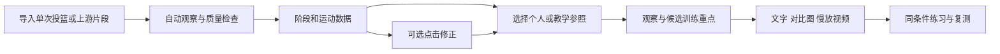
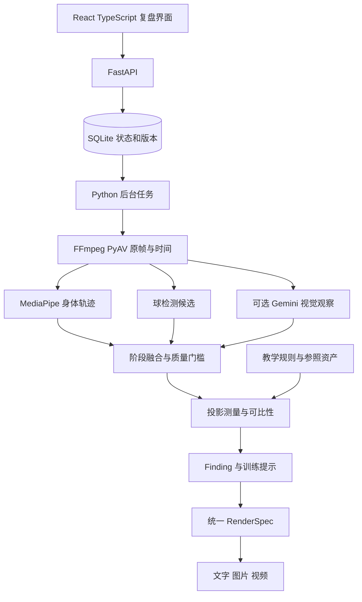

# Shot Form Coach 改进版方案

本方案整合已讨论的模型分工、投篮纠正研究和可选阶段修正。目标是把一次动作观察连接到源帧、可比参考、一项可尝试的训练提示和下一次复测。工程首版聚焦固定机位、无防守的定点跳投，重点比较节奏和随挥的一致性。

## 已确定的设计

- 独立于 Video Event Workbench；通过导出合同导入片段和源时间，不共享运行数据库。
- 默认自动分析，用户可用一两次点击修正离手区间和关键阶段，不要求逐球批准。
- MediaPipe/球候选与程序计算提供可复核的轨迹、时序和质量状态；Gemini / Astra 提供可选的视觉阶段观察与受证据约束的解释。
- 库里等教学资料提供有出处的原则；个人样本和后续可靠示范提供运动参照。参考相似度不能单独建立错误或因果判断。
- 每条发现关联属性、阶段、测量、参考、证据和复测目标；统一生成文字、图片与视频。
- 复盘与练习模式分别服务“看清差异”和“执行一个短提示”，用户可以按需查看反馈。

## V1 的用户闭环

首个验收情景：导入现有投篮样例，看到自动姿态/阶段和曲线，选第二球作随挥属性参照，查看第一球可见的差异，修正离手区间，再导出对应版本的三种报告。第一版的建议以观察和训练假设呈现，效果由复测确认。

## 技术与状态所有权

本地状态拥有原始观测、当前阶段修订、测量、发现和产物关系。模型响应拥有原始提议；用户修正只更新当前阶段版本，不覆盖原提议。后台旧任务发布前核对版本。修改阶段/参照后，沿依赖重算相关结果，保留已有媒体和未变轨迹。

## 数据合同

| 对象 | 必备内容 | 主要约束 |
| --- | --- | --- |
| ShotAsset | 媒体哈希、解码帧索引、源/片段时间、上游身份、情境 | 导入副本独立保存；坐标转换可追溯 |
| ObservationTrack | 关键点/球候选、时间、可见性、模型版本 | 原始/过滤分开；缺失有原因 |
| PhaseRevision | 模型原提议、有效区间、证据帧、来源和修订号 | 未修正提议不算人工确认；离手保持区间 |
| Measurement | 数值/单位、投影坐标系、有效窗口、质量和证据 | 条件不足为 null；不写假精度 |
| Reference | 类型、情境、视角、阶段、来源和适用属性 | 一球可以只作为一个属性的参照 |
| Finding | 属性、观察、差异、解释假设、提示、证据、复测 | 观察/假设/改善效果分别标识 |
| RenderSpec | 分析/阶段/参照版本、帧和标记、输出时间映射 | 三种报告来自同一记录 |

## V1 的自动判断与降级

人物、球、身体点、阶段和参考分别检查质量。球候选与手部关系可提出离手区间；无法支持物理离手时保留未知，并可提供单独的伸展高点候选。遮挡、切断的后续动作、运动模糊、错人物和视角不匹配会影响对应指标，不强行影响所有可见观察。

自动报告完成后，用户可修正。报告说明其使用的阶段来源和可见证据，不把高模型分数解释为坐标准确率，也不把修正时间标签解释为技术姿势正确。

## 比较与教学规则

先做阶段对齐，再根据情境、出手侧和拍摄条件判断可比性。身体相对位置采用明确的投影与归一化定义。跨视角优先并排示范和定性观察；未经验证的 3D 估计不进入精确角度/力量判断。

首批属性为节奏、举球路径、随挥和可见稳定性。先复用小范围教学来源与个人参照，报告最多一到三个候选重点。每次练习只聚焦一个提示，可采用动作、外部目标或中性语言，并记录采用哪一种提示。

## 图片和视频

使用原帧、骨架、球候选、区域框和必要的教学示意。参考与本人明确命名；图中每条线来自观测/测量或标记为示意。视频同步展示相同阶段、慢放和关键帧停留，保留源时间与可见窗口。需要参考真人时通过登记资产导入；当前公开库里资料提供知识，尚不提供完整实测运动基准。

## 模型与评估

V1 首先建立本地测量基线，保留 Gemini 作为语义辅助。模型输入、采样、版本、usage、费用和失败记录保存；相同输入比较与实际系统比较分别实施。Astra 的关键帧方案已接入 API 与 Codex 两种通道，Qwen 的自部署方案按[模型评测方案](MODEL_EVALUATION.zh-CN.md)接入。

工程验收检查源时间、可选修正、版本一致性、质量降级和真实导出。专项动作评测需要跨场次标注与教练盲评；训练效果需要无提示/跨日复测。三维纠正动画、标定的理想球轨迹和自有阶段模型按这些结果逐步开放。

## 首版范围与后续

首版包含本地单用户应用、现有片段导入、真实视觉观察、阶段提议与修正、个人/教学参照、属性报告及三种导出。当前范围内的数据不足以支持统一的全身评分、精确真实三维、力/指压/旋转或改善命中率的承诺。

实施顺序和当前验收状态见[实施计划](IMPLEMENTATION_PLAN.zh-CN.md)。原方案与研究保留为设计依据；本文件是 V1 范围与架构的当前版本。

## 本次工程实现的具体取舍

界面以视频证据为主：左侧片段与采集条件、中间原帧/对齐参照及可选修正、右侧可用指标和一个练习提示。浅绿为观察/可用，琥珀为估计或质量问题。Arial/PingFang SC 随系统字体显示，正文 12–14px，标题 24–29px，8px 级间距；窄屏按导入、观察、修正、指标顺序排列。照片使用真实导入数据，不提供虚构理想姿势。动作区域固定裁切，原帧可切回；导出记录裁切坐标。

当前 V1 为复盘界面，离手修正可操作；训练提示作为复测假设展示，训练记录/练习模式尚未实现。原始轨迹直接保存，曲线断开缺失帧。首批五项测量与投影比较已实现，足部/躯干稳定性和时序滤波后续另验。Gemini / Astra 采用有帧 ID 的图像序列输入。Astra 通过 Codex 登录复用订阅，合成图像的实时通路已验证；真实投篮数据验证须明确授权。具体检查与限制见 [V1 验证记录](VALIDATION_V1.md)。

## V0.4：以用户的训练决策组织复盘

用户首先需要知道这球总体如何、先改哪几件事、下一组如何练习。首屏按「综合评价 / 动作摘要 → 最多三个主要问题 → 下一组练法 → 四项动作指标」组织。每个问题显示观察、可信教学目标、优先级与独立的证据把握，并能跳回所引视频；原因与完整练法可以展开。视频仍可逐帧、慢放、叠加姿态和校准离手。个人参照、详细投影测量、来源、导出和任务/费用记录置于可操作的折叠区。

沿用浅绿背景与深绿动作按钮，琥珀标示需关注的内容；状态同时有文字，不依赖颜色。桌面保留紧凑片段栏与宽复盘区，手机改为横向片段条及单列任务顺序。系统字体、清晰标题和舒适行距为主，主操作触控区域约 44px。分析参数通过右上角统一设置面板管理，页面的分析按钮旁仅显示当前方式；记住用户明确选择，默认仍为本地，不自动发送视频。

四项主指标为下沉到出手时长、离手附近手的位置、可见的抬手保持时长、随挥手位变化。它们仍为画面测量，并非通用动作评分。保持时长的「至少」只覆盖连续可见且明确抬手的前缀，并从离手区间的最晚端点计时；高帧率、遮挡和不确定手位不会被误算成完整保持。

综合模型复盘读取五项有出处的 rubric：协调起身、可控落地、舒适出手、辅助手支撑、放松随挥。模型提供双语概述、少量有证据的优点及最多三个问题；每个问题必须引用输入帧和对应教学来源。教学目标由服务端可信 rubric 固定，模型不能编造标准角度或用一次投篮断定长期习惯。未经教练确认的自动建议为初步关注优先级；随挥之后的变化仅作低优先级练习线索，不能解释未进原因。

本地模式提供明确标记的动作摘要，不假装完成全身技术诊断；缺少证据时不凑问题或给满分。页面在本地摘要旁提示如何使用 Gemini/Astra 获取综合评价。当前教学库是公开教学原则，不含库里本人逐帧实测动作。个人参照只支持同条件观察差异，不能自动成为标准投篮。

所有输出共用同一 coaching 对象：网页、Markdown、对比图片与视频使用相同阶段和报告版本。旧报告、不同参照、不同语言或不同版本的导出不可冒充当前评价。后台可从已缓存轨迹更新动作摘要，无需新的模型请求。

验收使用已有六个真实片段作本地检查；三问题排列的交互用明确标注的合成 UI fixture 检查，不把虚构评价放到真实人物画面上。真实模型协议用无个人内容的合成图验证。详见 VALIDATION_V1.md 的 V0.4 记录。

## 统一设置入口

右上角「设置」打开统一侧边面板，按分析、素材导入、个人参照、播放显示、语言组织。模型选择、出手侧、视角、投篮情境、参照条件、播放偏好和语言均集中在这里；侧栏只负责选择投篮，正文保留复盘、回放与执行操作。设置面板使用原生 dialog，支持键盘焦点限制、Escape、关闭按钮及返回原入口；手机使用全宽面板并在面板内部滚动。

「从 Workbench 导入」改为「导入已截好的投篮」，明确它读取 Video Event Workbench 已完成任务中的短片段与原视频时间，不是另一种分析模型。未配置、暂无片段和读取失败分别显示可理解的状态。导入后会使用当前选择的方式分析，按钮和说明明确这个行为。修改设置本身不触发重新分析。
